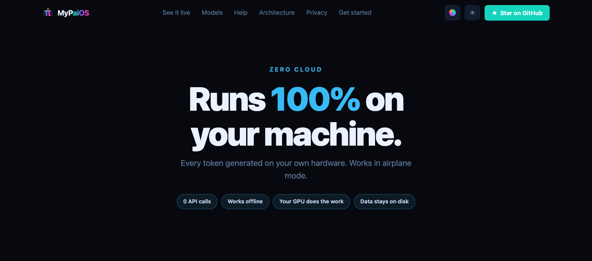
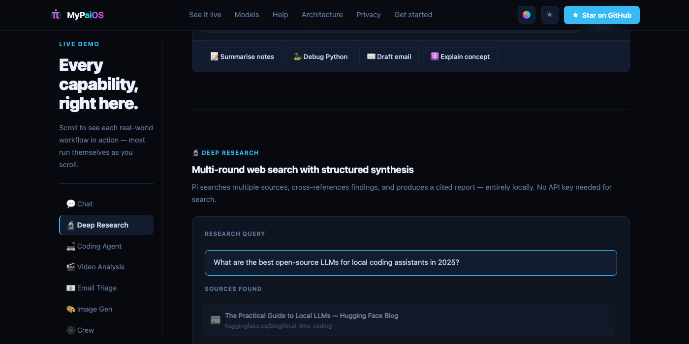
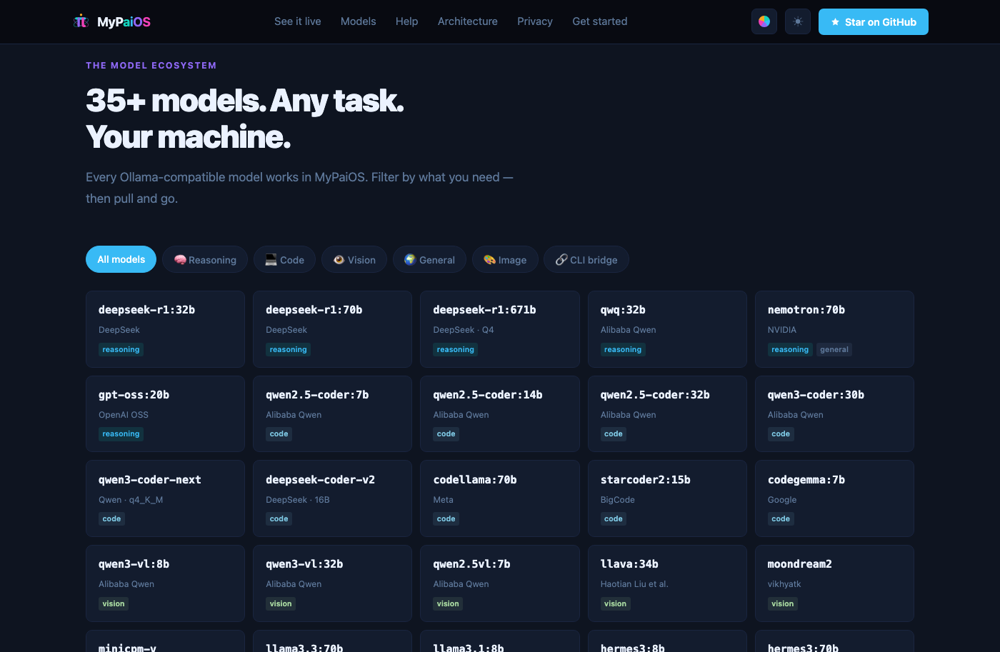
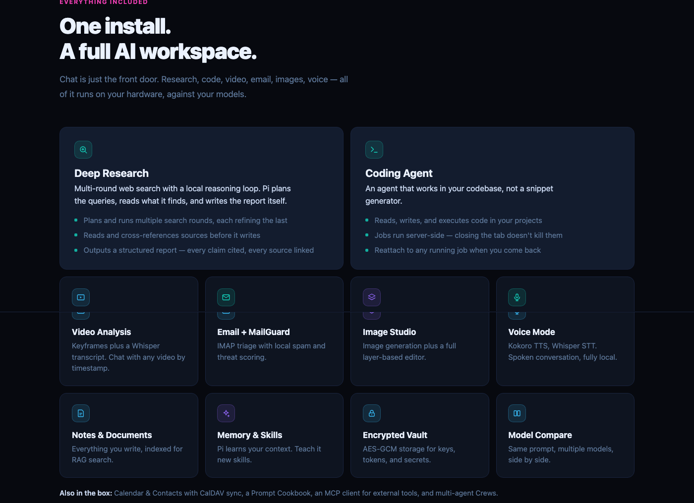
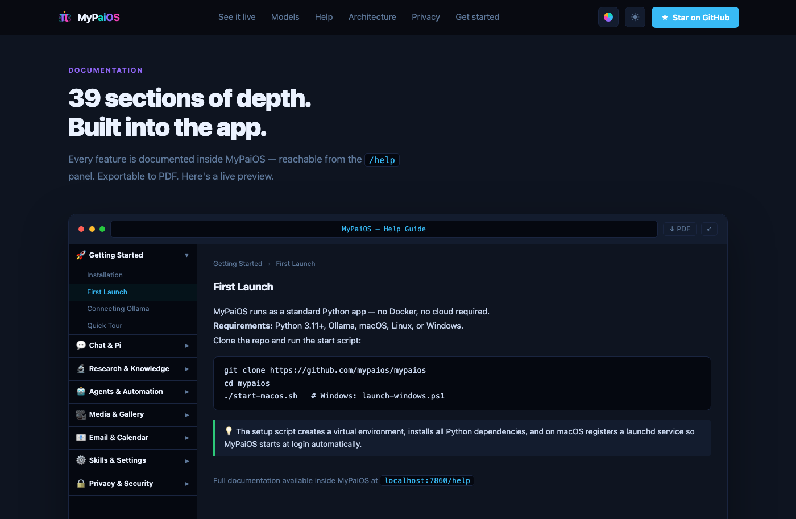
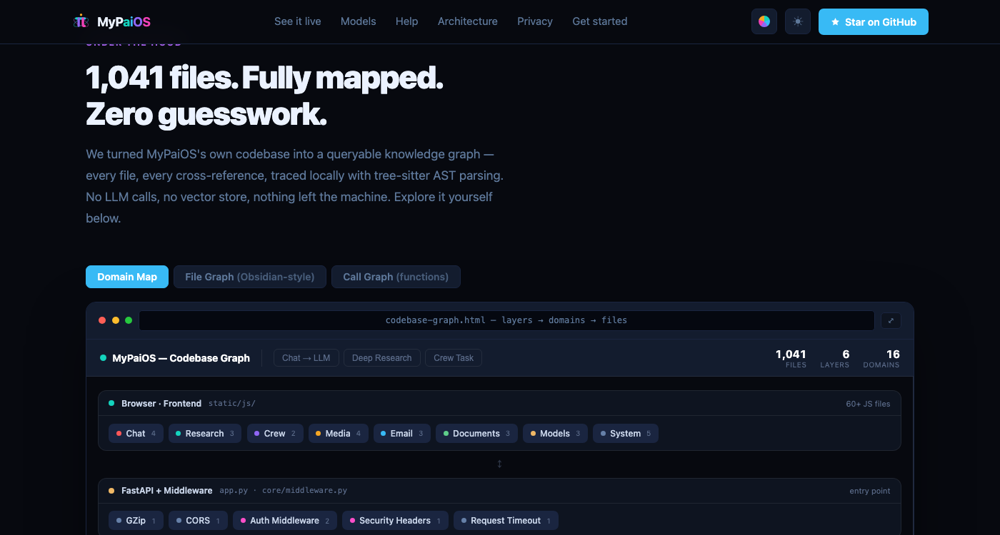

<div align="center">

<picture>
  <source media="(prefers-color-scheme: dark)" srcset="docs/banner-dark.svg">
  
</picture>

[](https://github.com/mypaios/mypaios/actions/workflows/ci.yml)
[](LICENSE)
[](https://github.com/mypaios/mypaios/tags)

</div>

**MyPaiOS** is a self-hosted, local-first AI workspace — one app that gives you the
chat / agents / research / documents experience of the big hosted assistants, running
entirely on your own hardware, against your own models, with your own data. The
assistant you talk to is **Pi** (the π mark). No telemetry, no subscription, no cloud
dependency for core function.

By **Vishal Pawar**.

*Built in the spirit of **Swarajya** — self-rule — inspired by Chhatrapati Shivaji Maharaj,
who built sovereignty from first principles. Your machine, your models, your data, your rule.*

> MyPaiOS is not affiliated with Kwaai pAI-OS (paios.org), aurintex paiOS, or PayOS.


## At a glance

|  |  |  |  |  |
|:---:|:---:|:---:|:---:|:---:|
| **1,041**<br><sub>files in the repo</sub> | **62**<br><sub>API route modules</sub> | **90**<br><sub>core engine modules</sub> | **35+**<br><sub>open-source models</sub> | **108**<br><sub>features verified against source</sub> |

### MyPaiOS vs. cloud AI

|  | MyPaiOS | ChatGPT | Claude | Gemini |
|---|:---:|:---:|:---:|:---:|
| Your data leaves your machine | ✅ No | ❌ Yes | ❌ Yes | ❌ Yes |
| Works offline | ✅ Yes | ❌ No | ❌ No | ❌ No |
| Choose any model | ✅ 35+ and growing | ❌ Their models only | ❌ Their models only | ❌ Their models only |
| Rate limits | ✅ None | ❌ Yes | ❌ Yes | ❌ Yes |
| Open source | ✅ MIT | ❌ No | ❌ No | ❌ No |

<sub>Cloud rows describe consumer plans as of mid-2026; enterprise terms differ.</sub>

## Features
  - **Chat** -- chat with any local model or API; adding them is super simple.<br>　<sub>vLLM · llama.cpp · Ollama · OpenRouter · OpenAI · GitHub Copilot</sub>
  - **Agent** -- hand Pi tools and let it run the whole task itself.<br>　<sub>built on [opencode](https://github.com/anomalyco/opencode) · MCP · web · files · shell · skills · memory</sub>
  - **Cookbook** -- scans your hardware, recommends models, click to download and serve — easy!<br>　<sub>built on [llmfit](https://github.com/AlexsJones/llmfit) · VRAM-aware · GGUF / FP8 / AWQ · fit scoring · vLLM / llama.cpp serving</sub>
  - **Deep Research** -- multi-step runs that gather, read, and synthesize sources into a nice visual report.<br>　<sub>adapted from [Tongyi DeepResearch](https://github.com/Alibaba-NLP/DeepResearch)</sub>
  - **Compare** -- a fun tool to compare models side by side. Test completely blind, no bias!<br>　<sub>multi-model · blind test · synthesis</sub>
  - **Documents** -- YOU write the text, AI is there to assist, not the opposite.<br>　<sub>multi-tab editor · markdown · HTML · CSV · syntax highlighting · AI edits · suggestions</sub>
  - **Memory / Skills** -- persistent memory and skills; Pi evolves over time as it better understands you and your tasks!<br>　<sub>ChromaDB · fastembed (ONNX) · vector + keyword retrieval · import/export</sub>
  - **Email** -- IMAP/SMTP inbox with AI triage built in: urgency reminders, auto-tag, auto-summary, auto-reply drafts, auto-spam.<br>　<sub>IMAP · SMTP · per-account routing · CalDAV-aware · replies are drafts only — the only automatic mail is urgency alerts to yourself</sub>
  - **Notes & Tasks** -- quick notes with reminders, a todo list, and scheduled tasks the agent can act on.<br>　<sub>note pings · checklist · cron-style tasks · ntfy / browser / email channels</sub>
  - **Calendar** -- local-first calendar with CalDAV sync to Radicale / Nextcloud / Apple / Fastmail.<br>　<sub>CalDAV pull · .ics import/export · per-calendar colors · agent-aware</sub>
  - **Voice & Video** -- talk to Pi hands-free, and drop videos into chat for a timestamped, chat-able digest.<br>　<sub>faster-whisper STT · Kokoro TTS · keyframes + transcript analysis</sub>
  - **Crew & Code** -- multi-agent orchestration and a Claude-Code-style coding agent with detached server-side runs.<br>　<sub>Plan / Act / Review / Research modes · survives disconnects · universal Stop</sub>
  - **Works on mobile** -- looks and runs great on your phone, not just desktop.<br>　<sub>responsive · installable (PWA) · touch gestures</sub>
  - **Extras** -- more to explore, happy if you give it a go!<br>　<sub>image editor · theme editor · file uploads (vision + PDF) · web search · presets · sessions · 2FA</sub>

## Demo
A full, hover-to-play tour lives on the landing page: **[mypaios.github.io/mypaios](https://mypaios.github.io/mypaios/)** (or clone and open `docs/index.html` in a browser).

<p align="center">
  <br>
  <sub>The looping intro on <a href="https://mypaios.github.io/mypaios/">mypaios.github.io/mypaios</a></sub>
</p>

<details>
<summary>More screenshots — live demo, model catalog, feature grid, help guide, architecture graph</summary>
<br>
<table>
<tr>
<td width="50%"></td>
<td width="50%"></td>
</tr>
<tr>
<td width="50%"></td>
<td width="50%"></td>
</tr>
<tr>
<td width="50%"></td>
<td width="50%">The full interactive versions &mdash; live demo panels, the filterable model catalog, three architecture-graph modes with click-through callers/callees, and the searchable help guide &mdash; are all on the <a href="https://mypaios.github.io/mypaios/">live site</a>.</td>
</tr>
</table>
</details>

## Quick Start

Defaults work out of the box: clone, run, then configure models/search/email
inside **Settings**. Only edit `.env` for deployment-level overrides like
`APP_BIND`, `APP_PORT`, `AUTH_ENABLED`, `DATABASE_URL`, or a pre-seeded admin password.

**What you need before you start:**

- **Python 3.11+** (3.13 works).
- **[Ollama](https://ollama.com/download)** — the easiest way to run local models.
  Install it, `ollama pull` a model, and MyPaiOS finds it at `http://localhost:11434/v1`.
  (Any OpenAI-compatible endpoint works too — vLLM, llama.cpp, LM Studio, or a cloud API key.)
- **System packages** for the media features:
  - macOS: `brew install ffmpeg espeak-ng tmux`
  - Debian/Ubuntu: `sudo apt install ffmpeg espeak-ng tmux`

  `ffmpeg` powers voice/video analysis, `espeak-ng` supports local TTS, and `tmux`
  lets Cookbook run model downloads/serves in the background. The core app boots
  without them; the related features just stay dormant.

### Native macOS (recommended on Apple Silicon)

```bash
git clone https://github.com/mypaios/mypaios && cd mypaios
./start-macos.sh
```

The script installs Homebrew deps, creates the venv, runs setup, and starts the
server at `http://127.0.0.1:7860` (port 7860 because AirPlay often squats on 7000).
Docker on macOS cannot use the Metal GPU, which is why native is the recommended
path on M-series Macs.

To expose it to your phone over a trusted LAN/VPN such as Tailscale:

```bash
PAIOS_HOST=0.0.0.0 ./start-macos.sh
# then open http://<tailscale-ip>:7860
```

To build a clickable app wrapper: `./build-macos-app.sh`.

### Native Linux / macOS (manual)

```bash
git clone https://github.com/mypaios/mypaios && cd mypaios
python3 -m venv venv
source venv/bin/activate
pip install -r requirements.txt
python setup.py
python -m uvicorn app:app --host 127.0.0.1 --port 7000
```

Open `http://localhost:7000`. The app itself is lightweight; local model serving is
the heavy part and depends on the model, runtime, GPU, and VRAM, so small hosts can
connect to API or remote model servers instead. Use `--host 0.0.0.0` only when you
intentionally want LAN/reverse-proxy access.

### Docker

```bash
git clone https://github.com/mypaios/mypaios && cd mypaios
cp .env.example .env       # optional, but recommended for explicit defaults
docker compose up -d --build
```

Open `http://localhost:7000` when the containers are healthy. Docker Compose binds
the web UI to `127.0.0.1` by default. If the port is taken, set `APP_PORT=7001` in
`.env` and recreate the container. To include optional extras in the image (PDF
viewer, Office extraction; includes AGPL PyMuPDF), build with
`docker compose build --build-arg INSTALL_OPTIONAL=true` before `up`.

### Native Windows

```powershell
git clone https://github.com/mypaios/mypaios; cd mypaios
powershell -ExecutionPolicy Bypass -File .\launch-windows.ps1
```

The launcher creates the venv, installs deps, runs setup, and starts the server;
safe to re-run. Or do it by hand:

```powershell
py -3.11 -m venv venv
venv\Scripts\Activate.ps1
pip install -r requirements.txt
python setup.py
python -m uvicorn app:app --host 127.0.0.1 --port 7000
```

The core app (chat, agent, memory, documents, email, calendar, deep research) runs
fully native. For full **Cookbook** background model downloads and the agent shell
tool, also install [Git for Windows](https://git-scm.com/download/win) (provides
`bash.exe`). Local GPU *serving* of vLLM/SGLang needs Linux/WSL2; for a local model
on Windows, [Ollama](https://ollama.com/download) is the easiest path — point
MyPaiOS at `http://localhost:11434/v1` in Settings.

### First run

On first setup, MyPaiOS creates an admin account (`admin` unless
`PAIOS_ADMIN_USER` is set) and prints a temporary password in the terminal.
For Docker installs, the same line is in `docker compose logs paios`.
Use that for the first login, then change it in **Settings**.

Contributing? See [CONTRIBUTING.md](CONTRIBUTING.md) for setup, testing, and
pull request guidelines.

<details>
<summary>Cookbook, GPU, Ollama, and troubleshooting notes</summary>

**Docker bundled services.** Compose starts MyPaiOS, ChromaDB, SearXNG, and
ntfy. MyPaiOS and the bundled service ports bind to `127.0.0.1` by default, so
they are reachable from the host but not exposed to your LAN/public internet
unless you opt in.

**Cookbook storage in Docker.** Downloads live in `./data/huggingface`
(`~/.cache/huggingface` in the container). Cookbook-installed Python CLIs and
serve engines live in `./data/local` (`~/.local` in the container), so they
survive container recreation.

**Remote servers.** In **Cookbook -> Settings -> Servers**, generate the
MyPaiOS SSH key and add the public key to the remote server's
`~/.ssh/authorized_keys`. From the host you can also run:

```bash
ssh-copy-id -i data/ssh/id_ed25519.pub user@server
```

**Docker GPU overlays.** CPU-only users can skip this section. Cookbook can
only detect GPUs that Docker exposes to the container — if the host runtime or
device passthrough is not configured, Cookbook sees the iGPU, another card, or
CPU instead of your intended GPU.

For NVIDIA, `scripts/check-docker-gpu.sh` diagnoses GPU passthrough and can
optionally install the host runtime or update `.env`.

```bash
# Read-only diagnostic (default — installs nothing, never edits .env):
scripts/check-docker-gpu.sh

# Print OS-specific install commands without running them:
scripts/check-docker-gpu.sh --print-install-commands

# Install NVIDIA Container Toolkit on Ubuntu/Debian (requires sudo):
scripts/check-docker-gpu.sh --install-nvidia-toolkit

# Write COMPOSE_FILE to .env (only when GPU passthrough is confirmed working):
scripts/check-docker-gpu.sh --enable-nvidia-overlay

# Full assisted setup — install toolkit, then enable overlay if passthrough works:
scripts/check-docker-gpu.sh --install-nvidia-toolkit --enable-nvidia-overlay
```

Safety notes:
- The app never installs host GPU runtime automatically.
- The app never edits `.env` automatically.
- `.env` is only modified when `--enable-nvidia-overlay` is explicitly passed,
  and only after GPU passthrough succeeds. `--yes` skips prompts but does not
  bypass the passthrough gate.
- `.env.bak.*` backups created by `--enable-nvidia-overlay` are ignored by
  Git and the Docker build context.

To enable manually without the script, add this to `.env`:

```bash
COMPOSE_FILE=docker-compose.yml:docker/gpu.nvidia.yml
```

**AMD / ROCm.** AMD setup is read-only diagnostic plus manual `.env` edit. Run:

```bash
scripts/check-docker-amd-gpu.sh
```

Then add the reported values to `.env`, replacing `RENDER_GID` with your host's
numeric render group id:

```bash
COMPOSE_FILE=docker-compose.yml:docker/gpu.amd.yml
RENDER_GID=989
```

For NVIDIA/AMD GPU support, also read the comments in the selected overlay file: docker/gpu.nvidia.yml or docker/gpu.amd.yml.

**Stack-management UIs (Portainer, Coolify, Dockhand, etc.).** These tools
often accept only a single Compose file and do not reliably honor `COMPOSE_FILE`
or multiple `-f` overlays. CLI users should keep using the `COMPOSE_FILE`
overlay workflow above. For stack UIs, point the stack at one of the standalone
files instead, which bundle the base stack plus the GPU settings:

- `docker-compose.gpu-nvidia.yml` — still requires the NVIDIA Container Toolkit
  on the host.
- `docker-compose.gpu-amd.yml` — still requires host ROCm/kfd/DRI setup, the
  `video`/`render` group membership, and `RENDER_GID` when needed.

The base `docker-compose.yml` plus the `docker/gpu.*.yml` overlays remain the
source of truth; the standalone files mirror them for single-file deployments.

Verify after enabling either overlay:

```bash
docker compose exec paios nvidia-smi -L   # NVIDIA
docker compose exec paios sh -lc 'test -e /dev/kfd && test -d /dev/dri && ls -l /dev/kfd /dev/dri/renderD*'  # AMD
```

> **GPU passthrough ≠ llama.cpp CUDA.** `nvidia-smi` passing inside the
> container confirms Docker GPU access, but llama.cpp also needs `cudart` and
> the CUDA Toolkit at runtime. If Cookbook logs show `Unable to find cudart
> library`, `Could NOT find CUDAToolkit`, `CUDA Toolkit not found`, or
> tensors/layers assigned to CPU, that is a Cookbook/llama.cpp build issue —
> not a Docker passthrough failure. Re-install the serve engine via
> **Cookbook → Dependencies** to get a CUDA-enabled build.
>
> The same split applies to AMD/ROCm: seeing `/dev/kfd` and `/dev/dri` inside
> the container confirms device passthrough, not ROCm userspace or a
> ROCm-enabled vLLM/llama.cpp build. `rocm-smi` and `rocminfo` are not expected
> inside the slim app image.

**Ollama with Docker.** If Ollama runs on the host, add this endpoint in
Settings:

```text
http://host.docker.internal:11434/v1
```

Ollama must listen outside its own loopback interface:

```bash
OLLAMA_HOST=0.0.0.0:11434 ollama serve
```

This connects MyPaiOS in Docker to an Ollama server that is already running on
your host machine; it does not start Ollama inside the container.
`host.docker.internal` is Docker's hostname for the host machine from inside the
container. Cookbook **Serve** is a separate workflow for serving downloaded
models through MyPaiOS/llama.cpp, so Windows users with an existing Ollama
install usually only need to add the endpoint in Settings.

**Useful checks.**

```bash
docker compose ps
docker compose logs --tail=120 paios
docker compose logs paios | grep -E 'ChromaDB|MemoryVectorStore|DEGRADED'
```

**macOS details.** `start-macos.sh` installs Homebrew deps, creates the venv,
runs setup, and starts uvicorn on port `7860` because AirPlay often holds
`7000`. It uses llama.cpp/Ollama for Metal. vLLM/SGLang are CUDA/ROCm-only and
do not run on macOS. MLX-only models are not served by MyPaiOS.

</details>

## Troubleshooting & Advanced Setup

### `chromadb-client` conflicts with embedded ChromaDB
If `chromadb-client` (the lightweight HTTP-only package) is installed alongside the full `chromadb` package, MyPaiOS starts but ChromaDB silently falls back to HTTP-only mode and fails.

**Fix:** uninstall `chromadb-client` and force-reinstall the full package:
```bash
./venv/bin/pip uninstall chromadb-client -y
./venv/bin/pip install --force-reinstall chromadb
```

### HTTPS + LAN/Tailscale exposure
To expose MyPaiOS on a local network or Tailscale with HTTPS:
1. Change the bind address to `0.0.0.0` in `.env` (`APP_BIND=0.0.0.0` or `PAIOS_HOST=0.0.0.0`).
2. Generate a locally-trusted cert for your LAN/Tailscale IPs using [mkcert](https://github.com/FiloSottile/mkcert):
   ```bash
   mkcert -install
   mkcert -cert-file cert.pem -key-file key.pem 192.168.1.100 tailscale-ip
   ```
3. Run `uvicorn` with the generated certs:
   ```bash
   python -m uvicorn app:app --host 0.0.0.0 --port 7000 --ssl-certfile=cert.pem --ssl-keyfile=key.pem
   ```
4. Install the `mkcert` CA on any other device you want to access MyPaiOS from (e.g., for iOS, email the `rootCA.pem` to yourself, install the profile, and trust it in Certificate Trust Settings).

### Optional Dependencies
`requirements-optional.txt` contains packages that unlock extra features. It is not installed by default.

| Package | Feature unlocked |
|---------|-----------------|
| `faster-whisper` | Local speech-to-text (microphone -> text) via the "local" STT provider. |
| `duckduckgo-search` | DuckDuckGo as a search provider option. |
| `PyMuPDF` | PDF page rendering in the side viewer panel and form-filling. (Note: AGPL-3.0) |
| `markitdown` | Office/EPUB document text extraction (converts .docx/.xlsx/.pptx/.xls/.epub to Markdown). |

## Security Notes
MyPaiOS is a self-hosted workspace with powerful local tools: shell access, file uploads, model downloads, web research, email/calendar integrations, and API tokens. Treat it like an admin console.

- Keep `AUTH_ENABLED=true` for any network-accessible deployment.
- Keep `LOCALHOST_BYPASS=false` outside local development.
- Use `SECURE_COOKIES=true` when MyPaiOS is served through HTTPS by a trusted reverse proxy or private access gateway.
- Do not expose it directly to the public internet without HTTPS and a trusted reverse proxy or private access layer.
- Keep `.env`, `data/`, `logs/`, databases, uploads, generated media, backups, auth/session files, API keys, and model/provider tokens out of Git and private shares. They are ignored by default.
- Review `data/auth.json` after first boot: disable open signup unless you intentionally want it, make only your own account admin, and keep demo/test accounts non-admin.
- Non-admin users do not get shell/Python/file read/write by default, and admin-only routes/tools such as MCP management, API tokens, webhooks, model/cookbook serving, backup/vault, and app settings are admin-gated. Other features are controlled by per-user privileges, so review each user's privileges before exposing a deployment.
- Rotate any API keys or tokens that were ever pasted into a shared chat, demo, screenshot, or log.
- If you enable API tokens or webhooks, create separate tokens per integration and delete unused ones.
- Prefer binding manual development runs to `127.0.0.1`; bind to `0.0.0.0` only when you intentionally want LAN/reverse-proxy access.
- Keep ChromaDB, SearXNG, ntfy, Ollama, vLLM, llama.cpp, databases, and raw model/provider APIs internal-only. Expose only the authenticated MyPaiOS web/API entrypoint through your trusted proxy or private access layer.
- Before publishing a fork, run `git status --short` and confirm no private files from `.env`, `data/`, `logs/`, uploads, backups, or local databases are staged.

See [SECURITY.md](SECURITY.md) for the reporting policy and
[THREAT_MODEL.md](THREAT_MODEL.md) for the trust boundary.

### Private or proxied deployments
MyPaiOS serves plain HTTP on its app port. Docker Compose binds the app and the bundled services to `127.0.0.1` by default, so a typical production/private setup is:

1. Keep MyPaiOS on localhost, for example `127.0.0.1:7000`.
2. Terminate HTTPS at a trusted reverse proxy or private access gateway.
3. Put the authenticated MyPaiOS web/API entrypoint behind that layer.
4. Keep raw service and model ports internal-only.

Cloudflare Access, Tailscale, Caddy, nginx, and Traefik can all fit this pattern; none are required. If your access layer reaches MyPaiOS on the same host, proxy to `http://127.0.0.1:7000` and keep `AUTH_ENABLED=true`, `LOCALHOST_BYPASS=false`, and `SECURE_COOKIES=true`.

Common internal-only ports from the default docs/compose setup:

| Port | Service |
|---|---|
| `7000` | MyPaiOS raw app port |
| `8080` | SearXNG |
| `8091` | ntfy |
| `8100` | ChromaDB host port for manual/compose access |
| `11434` | Ollama |
| `8000-8020` | Common local model/provider APIs |

## Contributing
Help is welcome. The best entry points are fresh-install testing, provider setup
bugs, mobile/editor polish, docs, and small focused refactors. See
[CONTRIBUTING.md](CONTRIBUTING.md) for the workflow (including DCO sign-off) and
[ROADMAP.md](ROADMAP.md) for the current help-wanted list.

## Configuration
Most setup is done inside the app with `/setup` or **Settings**. Use `.env`
for deployment-level defaults and secrets you want present before first boot.
Key settings:

| Variable | Default | Description |
|---|---|---|
| `LLM_HOST` | `localhost` | Your LLM server (e.g. `llm-host.local:8000`) |
| `LLM_HOSTS` | -- | Comma-separated list for model discovery |
| `OPENAI_API_KEY` | -- | Optional OpenAI key. Prefer adding providers in the app unless pre-seeding. |
| `SEARXNG_INSTANCE` | `http://localhost:8080` | SearXNG URL. Docker overrides this to `http://searxng:8080`. |
| `SEARXNG_SECRET` | generated on first Docker boot | Optional SearXNG cookie/CSRF secret. Leave blank unless you need to pin it. |
| `APP_BIND` | `127.0.0.1` | Docker Compose host bind address for the web UI. Use `0.0.0.0` only for intentional LAN/reverse-proxy access. |
| `APP_PORT` | `7000` | Docker Compose host port for the web UI. |
| `AUTH_ENABLED` | `true` | Enable/disable login |
| `LOCALHOST_BYPASS` | `false` | Development-only auth bypass for loopback requests. Keep false for shared/network deployments. |
| `SECURE_COOKIES` | `false` | Set true when serving through HTTPS at a trusted proxy or private access gateway. |
| `DATABASE_URL` | `sqlite:///./data/app.db` | Database connection string |
| `CHROMADB_HOST` | `localhost` | ChromaDB host for vector memory. Docker overrides this to `chromadb`. |
| `CHROMADB_PORT` | `8100` | ChromaDB port for manual host runs. Docker overrides this to `8000`. |
| `EMBEDDING_URL` | -- | OpenAI-compatible embeddings endpoint |

> **Note on internal names:** environment variables (`PAIOS_*`), element ids,
> `paios-*` localStorage keys, headers, and module paths keep the project's
> historic `paios` identifiers. This is intentional — renaming them would break
> running installs. Only user-visible text uses the MyPaiOS name.

### Built-in MCP servers (optional setup)

MyPaiOS auto-registers a few built-in MCP servers at startup. The npx-based ones (currently the browser server, `@playwright/mcp`) only start when their npm package is already in the local npx cache. If a package isn't cached, that server is skipped with a startup log message explaining what to do, so a fresh install does not block on a multi-minute npm download or hang if Playwright system deps are missing.

To enable the browser MCP (page navigation, screenshots, vision), run once:

```bash
npx -y @playwright/mcp@latest --version
```

That installs `@playwright/mcp` plus Playwright (~300MB total). Restart the app and the server will register at startup.

## Architecture
```
app.py                   # FastAPI entry point
core/      auth, database, middleware, constants
src/       llm_core, agent_loop, agent_tools, chat_processor, search/
routes/    chat, session, document, memory, model … endpoints
services/  docs, memory, search, hwfit (Cookbook) …
static/    index.html + app.js + style.css + js/ (modular front-end)
docs/      landing page (index.html) + preview clips
```

## Data
All user data lives in `data/` (gitignored): `app.db` (sessions, messages, documents),
`memory.json`, `presets.json`, `uploads/`, `personal_docs/`, `chroma/`, `settings.json`.

## Credits

MyPaiOS stands on a lot of open-source work. Full details and license texts are in
[ACKNOWLEDGMENTS.md](ACKNOWLEDGMENTS.md), [`NOTICE`](NOTICE) and
[`licenses/`](licenses/).

- **[Odysseus](https://github.com/pewdiepie-archdaemon/odysseus)** — MyPaiOS is a
  fork of the open-source Odysseus project, taken at the MIT-licensed snapshot
  (commit `8354948`, 2026-06-05). Upstream relicensed to AGPL-3.0 on 2026-06-09;
  **no post-fork upstream code is included**, and this fork remains under the
  original MIT terms of that snapshot. **Most of this codebase is Odysseus's
  work** — 877 of 1030 files are inherited (626 byte-identical), only 31 of 929
  commits are post-fork, and roughly 6% of the source lines are MyPaiOS's. The
  measured breakdown, and what MyPaiOS actually added, are in
  [ACKNOWLEDGMENTS.md](ACKNOWLEDGMENTS.md).
- **[opencode](https://github.com/anomalyco/opencode)** (MIT) — adapted for
  agent-loop / tool-execution patterns and UI concepts, and for the GitHub
  Copilot provider.
- **[llmfit](https://github.com/AlexsJones/llmfit)** by Alex Jones (MIT) — the
  engine behind Cookbook's hardware-aware model download / serve / fit scoring.
- **[Tongyi DeepResearch](https://github.com/Alibaba-NLP/DeepResearch)** by
  Alibaba-NLP / Tongyi Lab (Apache-2.0) — the multi-step deep-research pipeline.
- **[talon](https://github.com/mailgun/talon)** by Mailgun Technologies, Inc.
  (Apache-2.0) — the multilingual email quote-detection patterns.
- **[LiteLLM](https://github.com/BerriAI/litellm)** (MIT) — the model price/context
  snapshot used for cloud cost tracking.
- **[Feather Icons](https://github.com/feathericons/feather)** by Cole Bemis
  (MIT) and **[Lucide](https://lucide.dev)** (ISC) — nearly every icon in the
  interface.
- All emojis designed by **[OpenMoji](https://openmoji.org/)** — the open-source
  emoji and icon project. License:
  **[CC BY-SA 4.0](https://creativecommons.org/licenses/by-sa/4.0/)**.
- **[Fira Code](https://github.com/tonsky/FiraCode)** and
  **[Inter](https://github.com/rsms/inter)** (SIL OFL 1.1) — the bundled fonts.
- **[Kokoro](https://huggingface.co/hexgrad/Kokoro-82M)** (Apache-2.0) — local
  text-to-speech; **[faster-whisper](https://github.com/SYSTRAN/faster-whisper)**
  (MIT) with SYSTRAN's CTranslate2 Whisper conversions — local speech-to-text;
  **[Docling](https://github.com/docling-project/docling)** (MIT, IBM) — the
  default document/OCR engine; **[mflux](https://github.com/filipstrand/mflux)**
  (MIT) on **[MLX](https://github.com/ml-explore/mlx)** (MIT, Apple) — local
  image generation.
- Plus SearXNG, ChromaDB, ntfy, Ollama, llama.cpp, Playwright, highlight.js,
  SheetJS, React and the rest of the stack credited in ACKNOWLEDGMENTS.md.

**MyPaiOS ships no model weights.** It downloads or recommends them on your
behalf, and their licenses vary widely — several are non-commercial or otherwise
not open source, including the default local generalist `hermes3:8b` (Llama 3
Community License). See
[AI model weights](ACKNOWLEDGMENTS.md#ai-model-weights-downloaded-at-runtime-never-bundled)
before any commercial use.

MyPaiOS is an independent project and is not affiliated with, sponsored by, or
endorsed by any of the vendors, models or services it connects to; all names and
marks belong to their respective owners. It is not affiliated with Kwaai pAI-OS
(paios.org), aurintex paiOS, or PayOS.

## License
MIT -- see [LICENSE](LICENSE) and [ACKNOWLEDGMENTS.md](ACKNOWLEDGMENTS.md).

```
                                  |
                                 |||
                                |||||
                  |    |    |   |||||||
                 )_)  )_)  )_)   ~|~
                )___))___))___)\  |
               )____)____)_____)\\|
             _____|____|____|_____\\\__
             \                       /
       ~^~^~~^~^~~^~^~~^~^~~^~^~~^~^~~^~^~
               ~^~  all aboard!  ~^~
       ~^~^~~^~^~~^~^~~^~^~~^~^~~^~^~~^~^~
```
